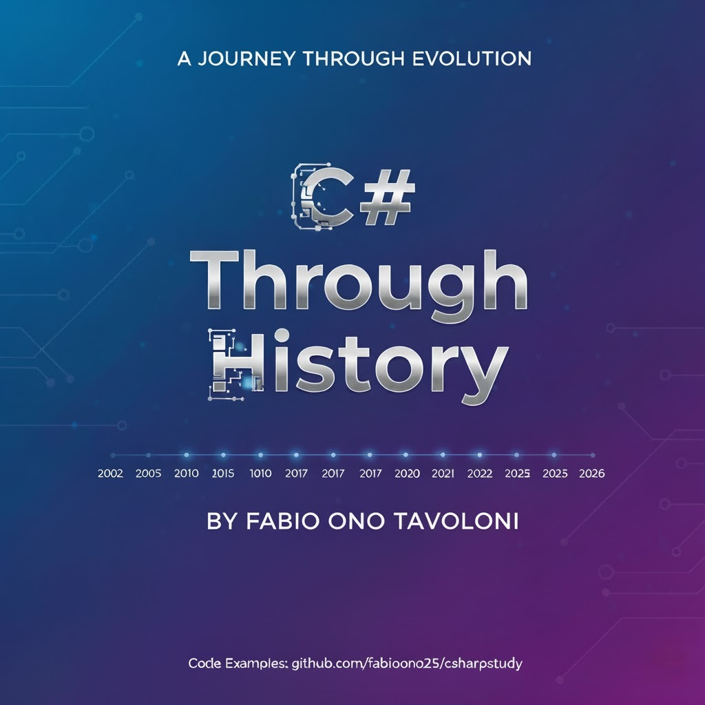

---

# Table of Contents

- [Table of Contents](#table-of-contents)
- [Preface — A Living Language](#preface--a-living-language)
- [About Me](#about-me)
- [Chapter 1 --- The Foundation and Evolution](#chapter-1-----the-foundation-and-evolution)
  - [1.1 The Need for C#](#11-the-need-for-c)
  - [1.2 The Arrival of .NET](#12-the-arrival-of-net)
  - [1.3 Standardization (ECMA-334 and ECMA-335)](#13-standardization-ecma-334-and-ecma-335)
  - [1.4 The Design Philosophy](#14-the-design-philosophy)
  - [Evolution Timeline](#evolution-timeline)
- [Chapter 2 --- C# 1.0: The Genesis](#chapter-2-----c-10-the-genesis)
- [Chapter 3 --- C# 2.0: The Generics Revolution](#chapter-3-----c-20-the-generics-revolution)
- [Chapter 4 --- C# 3.0: The Functional Shift](#chapter-4-----c-30-the-functional-shift)
- [Chapter 5 --- C# 4.0: The Dynamic Era](#chapter-5-----c-40-the-dynamic-era)
- [Chapter 6 --- C# 5.0: The Asynchronous Evolution](#chapter-6-----c-50-the-asynchronous-evolution)
- [Chapter 7 --- C# 6.0: Code Simplification](#chapter-7-----c-60-code-simplification)
- [Chapter 8 --- C# 7.0: Data \& Pattern Matching](#chapter-8-----c-70-data--pattern-matching)
- [Chapter 9 --- C# 8.0: Nullable Reference Types](#chapter-9-----c-80-nullable-reference-types)
- [Chapter 10 --- C# 9.0: Immutability \& Minimalism](#chapter-10-----c-90-immutability--minimalism)
- [Chapter 11 --- C# 10.0: Cleaner Codebases](#chapter-11-----c-100-cleaner-codebases)
- [Chapter 12 --- C# 11.0: Raw Strings \& Generic Math](#chapter-12-----c-110-raw-strings--generic-math)
- [Chapter 13 --- C# 12.0: Refining Type Definitions](#chapter-13-----c-120-refining-type-definitions)
- [Chapter 14 --- C# 13.0: Advanced Performance Features](#chapter-14-----c-130-advanced-performance-features)
- [Chapter 15 --- C# 14.0: Evolving the Language Core](#chapter-15-----c-140-evolving-the-language-core)
- [Conclusion \& Resources](#conclusion--resources)

---

# Preface — A Living Language

Welcome to **C# Through History**, a unique guide that explores not only *what* changed in each version of C#, but *why*.

C# is not a static programming language. It is *alive*, constantly evolving to meet the demands of modern development, from cloud computing
to high-performance applications.

This ebook is designed to help you understand:

* The historical context behind each feature.
* How C# evolved in parallel with the .NET platform.
* Why certain limitations led to new constructs.
* The design philosophy guiding the language today.

This document is also a **living resource**, updated as new versions of C# are released. As of now:

* The latest stable release is **C# 14.0** with **.NET 10** (projected late 2026).
* To be in sync about the next releases, follow the official language repository: [github.com/dotnet/csharplang](https://github.com/dotnet/csharplang).

All examples in this book are sourced in this **current repository**: [github.com/fabioono25/csharpstudy](https://github.com/fabioono25/csharpstudy). Feel free to enjoy and propose improvements.

---

# About Me

I have started my career in early 2022, working as a fullstack developer (ASP3, VBScript, SQL Server and other **vintage stuff**).

My journey into .NET and C# happened naturally through client work—it wasn’t a planned choice, but rather a consequence of the path I was on.

In my view, the technology stack matters less than the mindset: we should always be learning, adapting, and giving our best. So all fine. 😄

Time has passed, the hair has started getting gray, but the passion for technology remains.

This material is both a personal gift and an invitation—an inspiration for younger generations to explore the world of technology and write their own stories.

If you want to follow more of my thoughts and technical insights, feel free to visit my blog: [My Life in Dev](https://www.mylifeindev.com).

---

# Chapter 1 --- The Foundation and Evolution

C# was created in the early 2000s at Microsoft, leaded by [Anders Hejlsberg](https://github.com/ahejlsberg), as the main language for the new **.NET Framework** . Its purpose was to deliver a modern, type-safe, object-oriented language capable of powering enterprise applications and resolving the complexities of existing tools.

## 1.1 The Need for C#

Before C#, Windows development faced a dual challenge:

* **C++:** Powerful, but highly complex and prone to errors.
* **VB6:** Easy to use, but limited in modern Object-Oriented capabilities.

Deployment was further complicated by COM. The industry needed a language that was **strongly typed, safe by default, highly productive, and unified** under a single runtime to meet increasing software complexity.

## 1.2 The Arrival of .NET

Released in 2002, the .NET Framework 1.0 provided the necessary ecosystem. It introduced the **Common Language Runtime (CLR)** , which handled critical services like **Garbage Collection (GC)** , and the unified **Base Class Library (BCL)** . C# was designed to integrate perfectly with the CLR, ensuring automatic memory management and true multi-language support from its inception.

## 1.3 Standardization (ECMA-334 and ECMA-335)

Shortly after its release, Microsoft submitted C# and the CLI to ECMA for open standardization. This was crucial for:

* **ECMA-334:** Formalizing the C# Language Specification.
* **ECMA-335:** Defining the Common Language Infrastructure (CLI).

Standardization guaranteed the language's long-term stability, promoted consistent compiler behavior, and allowed for alternative platform implementations like Mono.

## 1.4 The Design Philosophy

From its inception, C# has been guided by five core principles that continue to drive its evolution:

1. **Modernity:** Clean, practical, and expressive syntax.
2. **Safety:** Strong typing and automatic memory management (GC).
3. **Productivity:** Features designed to reduce boilerplate code.
4. **Interoperability:** Seamless interaction with Windows and .NET components.
5. **Evolvability:** The ability to grow and extend without sacrificing backwards compatibility.

## Evolution Timeline

| Year     | Version | Major Features                                                                             |
| :--------- | :-------- | :------------------------------------------------------------------------------------------- |
| **2002** | C# 1.0  | Classes, structs, delegates, events, interfaces                                            |
| **2005** | C# 2.0  | Generics, nullable value types, partial classes, iterators                                 |
| **2007** | C# 3.0  | LINQ, lambdas, extension methods, var keyword                                              |
| **2010** | C# 4.0  | `dynamic`, named/optional parameters                                                       |
| **2012** | C# 5.0  | `async`/`await` (Task-based Asynchronous Pattern)                                          |
| **2015** | C# 6.0  | String interpolation, null-conditional operators (`?.`)                                    |
| **2017** | C# 7.0  | Tuples, pattern matching, local functions,`out var`                                        |
| **2019** | C# 8.0  | Nullable Reference Types (NRTs), default interface methods                                 |
| **2020** | C# 9.0  | Records, top-level statements, init-only properties                                        |
| **2021** | C# 10.0 | Global usings, file-scoped namespaces, record structs                                      |
| **2022** | C# 11.0 | Raw string literals, generic math, required members                                        |
| **2023** | C# 12.0 | Primary constructors, collection expressions, default lambda parameters                    |
| **2024** | C# 13.0 | Interceptors, advanced ref features (e.g., field/property accessors for`ref` parameters)   |
| **2025** | C# 14.0 | Params expansion (generalized access to collection elements), ongoing language refinements |

---

# Chapter 2 --- C# 1.0: The Genesis

Summary:
C# 1.0 introduced the essential building blocks of object-oriented
design and the .NET Framework.

Topics:

* Classes, structs, interfaces
* Inheritance & polymorphism
* Delegates and events
* Boxing and unboxing
* Entry point: `static void Main`

---

# Chapter 3 --- C# 2.0: The Generics Revolution

Summary:
C# 2.0 added generics, solving type-safety and performance issues while introducing tools for simpler collection handling.

Topics:

* Generics (`List<T>`, `Dictionary<K, V>`)
* Nullable value types (`int?`)
* Partial classes
* Iterators (`yield return`)
* Anonymous methods

---

# Chapter 4 --- C# 3.0: The Functional Shift

Summary:
C# 3.0 introduced LINQ and lambda expressions, enabling a more declarative, functional programming style.

Topics:

* LINQ (Query and Method syntax)
* Lambdas and Expression Trees
* Extension methods
* `var` keyword (Implicitly typed locals)
* Object/collection initializers

---

# Chapter 5 --- C# 4.0: The Dynamic Era

Summary:
This version enabled flexible interop with dynamic languages and COM components using the `dynamic` keyword.

Topics:

* `dynamic` keyword (Runtime binding)
* Optional & named parameters
* Generic covariance & contravariance
* Embedded interop types (No-PIA)

---

# Chapter 6 --- C# 5.0: The Asynchronous Evolution

Summary:
`async`/`await` changed asynchronous programming forever, making complex, non-blocking code easy to write and read.

Topics:

* `async`/`await` keywords
* TAP model (`Task` and `Task<T>`)
* Asynchronous exception handling
* Synchronization context

---

# Chapter 7 --- C# 6.0: Code Simplification

Summary:
C# 6.0 focused on removing boilerplate code and improving code clarity, making the common cases simpler and more concise.

Topics:

* Null-conditional operator (`?.`, `?[]`)
* String interpolation (`$""`)
* Expression-bodied members
* `nameof` expressions
* `using static`

---

# Chapter 8 --- C# 7.0: Data & Pattern Matching

Summary:
C# 7.0 provided powerful tools for working with data structures, including flexible tuples and the first major steps into pattern matching.

Topics:

* Tuples & Deconstruction
* Initial Pattern Matching (`is` and `switch` patterns)
* Local functions
* `out var` (inline declaration)
* `ref` locals and returns

---

# Chapter 9 --- C# 8.0: Nullable Reference Types

Summary:
A landmark safety release, C# 8.0 introduced Nullable Reference Types (NRTs) to help prevent `NullReferenceException` errors.

Topics:

* Nullable Reference Types (`string?`)
* Default interface methods
* Switch expressions
* `using` declarations (scoped)
* Asynchronous Streams (`IAsyncEnumerable<T>`)

---

# Chapter 10 --- C# 9.0: Immutability & Minimalism

Summary:
This version focused on clean, data-centric design by introducing records for immutable data and simplifying program entry points.

Topics:

* Records (value equality and `with` expressions)
* Init-only properties
* Top-level statements
* Relational and logical pattern improvements

---

# Chapter 11 --- C# 10.0: Cleaner Codebases

Summary:
C# 10.0 significantly reduced project clutter and boilerplate through global directives and file-scoped declarations.

Topics:

* Global usings
* File-scoped namespaces
* Record structs
* Lambda improvements (explicit return type)

---

# Chapter 12 --- C# 11.0: Raw Strings & Generic Math

Summary:
C# 11.0 introduced features for easier handling of complex strings (like JSON/XML) and enabled powerful new abstractions for numerical types.

Topics:

* Raw string literals (`"""`)
* Generic Math (`static abstract` members in interfaces)
* Required members (`required` keyword)
* List patterns (advanced sequence matching)
* Generic attributes

---

# Chapter 13 --- C# 12.0: Refining Type Definitions

Summary:
C# 12.0 enhanced type initialization and collection syntax, continuing the trend of increased conciseness and developer efficiency.

Topics:

* Primary constructors (for all classes and structs)
* Collection expressions (unified collection initialization)
* Default parameters for lambda expressions
* Alias Any Type (`using` aliases for tuples, arrays)

---

# Chapter 14 --- C# 13.0: Advanced Performance Features

Summary:
Scheduled for late 2024/early 2025, C# 13.0 focuses on low-level performance and advanced features, most notably interceptors.

Topics:

* Interceptors (Compile-time method call redirection)
* Advanced `ref` features (e.g., field/property accessors for `ref` parameters)
* Stack allocation improvements

---

# Chapter 15 --- C# 14.0: Evolving the Language Core

Summary:
Projected for late 2025/early 2026, C# 14.0 continues the evolution, aiming for improved expressiveness, especially around collections and memory handling.

Topics:

* Params expansion (generalized access to collection elements)
* Refinements to method group conversions
* The continuous cycle of .NET annual releases

---

# Conclusion & Resources

* Companion GitHub repository: [github.com/fabioono25/csharpstudy](https://github.com/fabioono25/csharpstudy)
* Official Microsoft Documentation: [https://learn.microsoft.com/en-us/docs/](https://learn.microsoft.com/en-us/docs/)
* C# Language Specification: [ECMA-334](https://ecma-international.org/publications-and-standards/standards/ecma-334/)
* Roslyn Repository> [https://github.com/dotnet/roslyn](https://github.com/dotnet/roslyn)
* C# Repository: [https://github.com/dotnet/csharplang](https://github.com/dotnet/csharplang)
